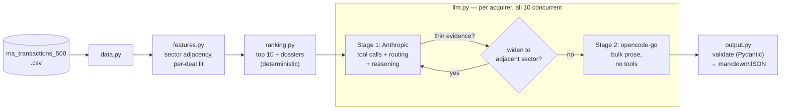

# M&A Acquirer Identification Engine

Given a target company profile (sector, deal size, geography), ranks the 10 most likely acquirers from a
500-row historical M&A transaction dataset and generates an MD-ready, data-cited one-page rationale for each.

## Quick start

```bash
# No API key needed -- deterministic canned rationales, fully offline
MOCK_LLM=1 ./run.sh rank --profile healthcare_services_default

# Real synthesis (requires ANTHROPIC_API_KEY + OPENCODE_API_KEY, see below)
./run.sh rank --profile healthcare_services_default

# Run all 10 synthetic test profiles (see data/synthetic_profiles.json)
./run.sh rank --all-profiles

# Custom target profile
./run.sh rank --sector "Medical Devices" --deal-size-mm 300 --geography Midwest
```

`run.sh` creates/reuses a `.venv`, installs dependencies, and loads `.env` automatically -- no other setup.
Output lands in `output/<profile_slug>/`: `summary.md` (ranked table), `01_<acquirer>.md` … `10_<acquirer>.md`
(one rationale each), `results.json` (same data, machine-readable). Runs in 30-45 seconds end-to-end (live,
10 rationales generated concurrently), well under the 60-second target.

`./run.sh enrich` re-runs the one-time Wikipedia pre-fetch for all acquirers -- not required to run the ranker;
the cache is already committed at `data/enrichment_cache.json`.

### Environment variables

See `.env.example` for the full list with defaults. The two that matter for a live run:

| Variable | Required | Purpose |
|---|---|---|
| `ANTHROPIC_API_KEY` | Yes (unless `MOCK_LLM=1`) | Stage 1: tool-calling, evidence gathering, routing |
| `OPENCODE_API_KEY` | Yes (unless `STAGE2_BACKEND=anthropic`) | Stage 2: bulk rationale synthesis |

Never commit `.env` -- it's gitignored. Copy `.env.example` to `.env` and fill in real values.

## Architecture



**Ranking is deterministic, no LLM involved** -- a two-tier fit score (sector adjacency, size, profile, recency,
outcome quality, tag alignment) rolled up per acquirer with a confidence dampener so one lucky deal can't
outrank a real track record. Fully reproducible; the shortlist is derived from data every run, never hardcoded.

**Sector adjacency is data-derived, not a hand-tuned prior** -- cosine similarity of acquirer overlap between
sectors, with an IDF-style downweight so generalist PE mega-funds (active in 8-10 of 10 sectors) don't inflate
every sector pair's similarity uniformly. Verified target-sensitive: top-10 overlap with the Healthcare Services
default ranges 0-5/10 across the other 9 synthetic profiles, and acquirer-type mix (Strategic vs. Financial
Sponsor) varies realistically by sector rather than sitting at a fixed ratio.

**LLM synthesis is a two-stage, tool-calling pipeline** (why not one prompt per acquirer? because that has no
tool use and no LLM-driven routing -- just a schema-constrained wrapper around one call):

- **Stage 1 (Anthropic)** selects and calls tools (`get_precedent_deals`, `get_valuation_comps`,
  `get_rationale_tag_overlap`) via the Messages API's native tool-use loop to gather evidence, and -- when an
  acquirer's evidence is thin -- decides whether to call `widen_to_adjacent_sector`. That decision is the one
  place the LLM's choice actually changes the code path; tools called unconditionally every time don't count as
  real routing. Output includes a mandatory `reasoning` field and stays short/cheap on purpose.
- **Stage 2 (opencode-go, `gpt-5.6-luna`)** writes the six-section rationale from Stage 1's finalized dossier +
  reasoning trace into a Pydantic-validated schema. No tools, no re-deciding anything -- just the bulk prose,
  which is where the actual token cost lives, hence the cheaper model (`STAGE2_BACKEND=anthropic` as fallback).
- Output validates against `RationaleOutput` (`app/schemas.py`) with a repair/retry loop on failure. The
  ranking layer, not the LLM, sets Conviction (High/Medium/Low by rank) -- the LLM only justifies it.

## Assumptions

- The default target profile (no `--sector`/`--deal-size-mm` given) is Healthcare Services, ~$200M EV,
  mid-market/private/regional/strong margins, per the assessment brief.
- "Regional" with no specific region given is treated as "any specific region is a full geography match" --
  only National/Multi-Regional deals score lower, since the target didn't rule out any particular region.
- Tier-1 signal weights (`sector_fit` 0.30 / `size_fit` 0.25 / `profile_fit` 0.20 / `recency` 0.10 /
  `outcome_quality` 0.10 / `tag_alignment` 0.05) and the eligibility threshold (3 relevant deals for full
  confidence) are documented constants, chosen to be directionally sensible and checked against both the
  target-sensitivity results above and the weight-sensitivity sweep below -- not fitted to any objective.
- "Relevant" deal = `sector_fit >= 0.35`; "adjacent" (widen-eligible) = `0.15 <= sector_fit < 0.35`.
- Conviction is rank-derived: High = rank ≤3, Medium = 4-7, Low = ≥8 -- a deliberate choice so conviction
  varies across the 10 acquirers rather than clustering, per the assessment's "conviction levels should vary
  and be defensible" guidance.
- `days_to_close` is null in ~19% of rows (only populated for `Closed` deals, which is structural, not a data
  quality bug) and isn't used by any ranking signal, so this doesn't affect scores.

## Weight sensitivity

Why 0.30 for `sector_fit` and not 0.35? Each weight in `app.features.WEIGHTS` was perturbed independently
(deltas renormalized so all six still sum to 1.0) and re-run against the default target profile, measuring
top-10 overlap with the unperturbed ranking:


`sector_fit` is the most sensitive weight (overlap drops to 6/10 at -0.30) -- makes sense, since it's the
primary driver of which sector a deal even counts as relevant. `tag_alignment` is the most robust (stays at
9-10/10 across the full range) since it's the smallest weight to begin with. Full 24-perturbation table with
Spearman rank correlation: `docs/weight_sensitivity.md` (reproduce with `python scripts/weight_sensitivity.py`
and `python scripts/plot_weight_sensitivity.py`).

## Known limitations

- **Grounding isn't machine-verified end-to-end.** A manual spot-check (Atrium Health) confirmed every cited
  deal, multiple, and geographic count traces exactly to the CSV, with one 0.1x rounding slip on an aggregate
  range (9.3x cited vs. 9.2x actual) -- not a fabrication, but no automated numeric-diff validator checks every
  figure on every run. First thing to add with more time.
- **Sector adjacency is a proxy** (buyer co-occurrence), not a direct measure of strategic adjacency. The IDF
  downweight sharpens it but doesn't eliminate the approximation.
- **Wikipedia enrichment covers 70/107 acquirers**, skewed toward large PE sponsors and public strategics.
  Missing acquirers fall back to CSV-only content, no crash. A business-entity filter plus one hard-coded
  exclusion catch known name-collisions but don't eliminate the risk entirely.
- **`STAGE2_BACKEND=anthropic` (opencode-go fallback) is implemented but not live-tested** -- same call shape
  Stage 1 already uses, but hasn't itself been run against a real opencode-go outage.
- **No feedback loop, no web UI** (arbitrary profiles work via CLI flags already), **no MCP exposure** --
  scoped out to stay within the assessment's intended effort level.
- **Weights are documented assumptions, checked for sensitivity but not fitted** -- the sweep above shows how
  robust the ranking is to each weight, not that 0.30/0.25/0.20/... is objectively optimal.

## Non-determinism handling

- `temperature=0` on every LLM call, passed via `extra_body` since the current Anthropic SDK deprecated it as
  a direct `messages.create()` parameter.
- The ranking layer is pure and deterministic -- acquirer list, order, and Conviction levels are always
  reproducible for a given target profile.
- LLM prose still has residual run-to-run variance at temperature 0 (a model property, not something this
  codebase controls). `MOCK_LLM=1` substitutes deterministic canned output for a zero-key demo and for testing
  the full pipeline -- including the conditional widen path -- deterministically.
- Every rationale is validated on the way out (`RationaleOutput`, Pydantic) with one repair/retry attempt
  before failing loudly for that acquirer, rather than silently shipping malformed output.

## Testing

```bash
MOCK_LLM=1 python -m pytest tests/ -q
```

33 tests covering the ranking/feature layer, the tool schemas and dispatch, the adjacent-sector-candidate
computation, and the full pipeline under `MOCK_LLM=1` -- including a test that specifically proves the
widen-to-adjacent-sector routing decision fires conditionally (not always, not never) for a real thin-evidence
acquirer, not just that the code path exists.
