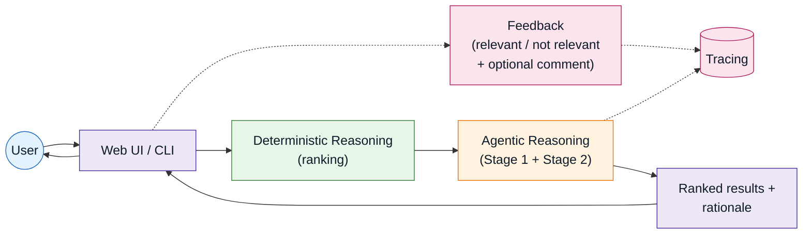
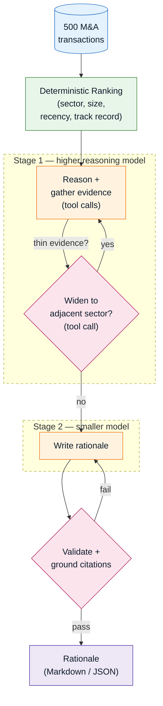
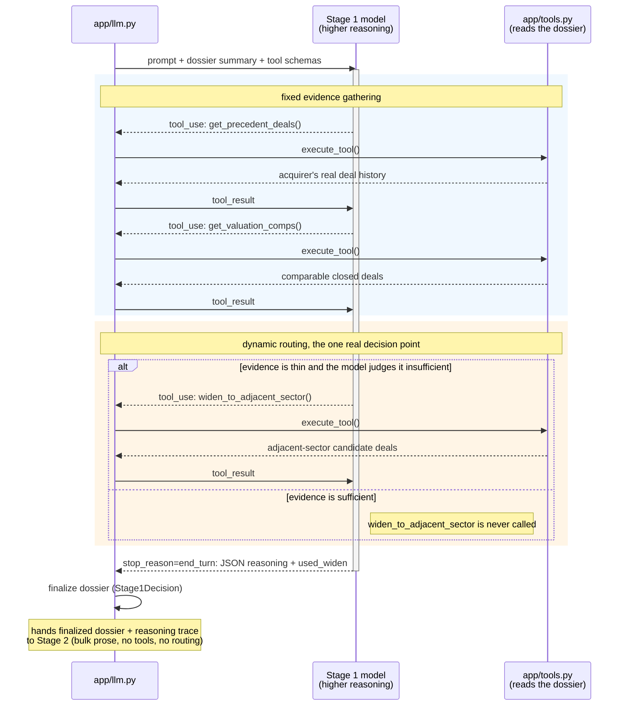
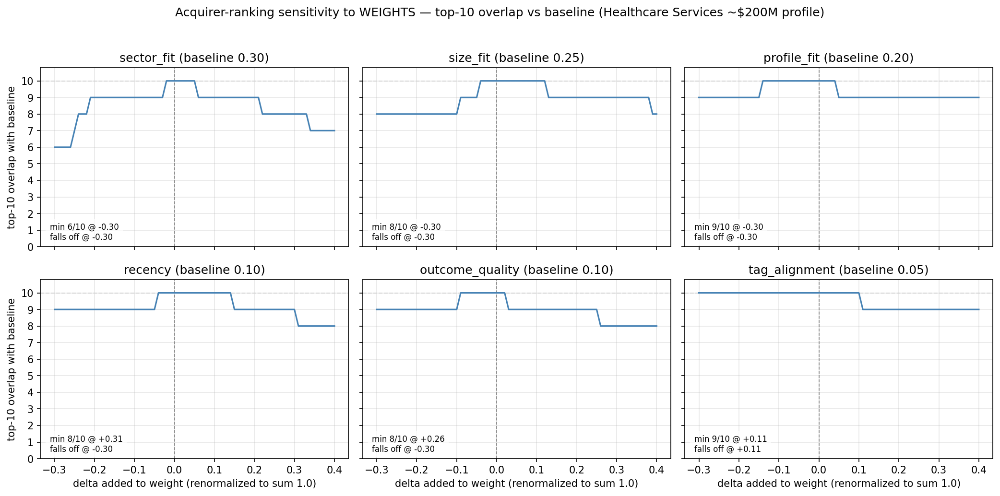

# M&A Acquirer Identification Engine

Given a target company profile (sector, deal size, geography), this engine identifies and ranks the most
likely acquirers for that target, then writes a one-page, data-cited rationale for each: the kind of
first-pass buyer list an M&A analyst would otherwise build by hand from deal comps and precedent transactions.

It works in two stages. First, a **deterministic ranking layer** scores every acquirer in the dataset against
the target profile (sector fit, deal-size fit, recency, track record) with no LLM involved, so the shortlist
itself is fully reproducible and never hardcoded (see [Architecture](#architecture) below). Then, for each of
the shortlisted acquirers in parallel (`asyncio.gather`, not a sequential loop), an **agentic LLM synthesis
layer** runs a reasoning step before acting, then selects and calls tools to gather the acquirer's actual deal
history, dynamically decides whether to widen the search into adjacent sectors when evidence is thin, and
writes the rationale into a Pydantic-validated schema with an automatic repair-retry loop, so a malformed or
fabricated citation gets corrected or rejected outright, never silently shipped (see [Grounding &
validation](#grounding--validation) below). The result is rationale that cites real, specific numbers,
including deal counts, size ranges, and EV/EBITDA multiples pulled from the acquirer's own history, not
generic boilerplate that could describe any acquirer.

The codebase mirrors that separation: ranking/scoring logic, LLM orchestration, structured-output validation,
and the UI each live in their own independently-testable module, not one file doing everything. Beyond the
core pipeline, this is built with production concerns in mind, not just a one-shot demo: every LLM call is
traced, with per-acquirer token usage and cost visible in a dashboard rather than buried in application logs,
and every generated rationale can be flagged relevant/not-relevant directly from the web UI, attached to that
specific trace. A comparison mode runs two target profiles side by side in one view. See [Observability &
feedback](#observability--feedback) below.

The data underneath is a 500-row historical U.S. healthcare M&A transaction dataset, one row per deal, with
the acquirer, target, sector, deal size, valuation multiples, and outcome for each. See
[data description](docs/data_description.md) for the full data profile (column-by-column breakdown,
categorical distributions, numeric ranges, top acquirers by deal count) if you want to understand the raw
material the ranking and rationale generation are built on.

## Quick start

```bash
# No API key needed: deterministic canned rationales, fully offline
MOCK_LLM=1 ./run.sh rank --profile healthcare_services_200mm

# Real synthesis (requires ANTHROPIC_API_KEY + OPENCODE_API_KEY, see below)
./run.sh rank --profile healthcare_services_200mm

# Run all 10 synthetic test profiles (see data/synthetic_profiles.json)
./run.sh rank --all-profiles

# Custom target profile
./run.sh rank --sector "Medical Devices" --deal-size-mm 300 --geography Midwest

# Compare two target profiles side by side
./run.sh rank --compare healthcare_services_200mm health_it_150mm_national
```

`run.sh` creates/reuses a `.venv`, installs dependencies, and loads `.env` automatically; no other setup.
Output lands in `output/<profile_slug>/`: `summary.md` (ranked table), `01_<acquirer>.md` … `10_<acquirer>.md`
(one rationale each), `results.json` (same data, machine-readable). Runs in 30-45 seconds end-to-end (live,
10 rationales generated concurrently), well under the 60-second target.

`./run.sh enrich` re-runs the one-time Wikipedia pre-fetch for all acquirers. It isn't required to run the
ranker; the cache is already committed at `data/enrichment_cache.json`.

`--compare SLUG_A SLUG_B` runs both target profiles' full pipelines concurrently (`app/main.py::compare_profiles`,
via `asyncio.gather`; each profile already runs its own acquirers concurrently internally) and writes a
side-by-side overlap summary to `output/compare_<slug_a>_vs_<slug_b>/comparison.md`, alongside each profile's
normal `output/<slug>/` directory. Only accepts known `--profile` slugs from `data/synthetic_profiles.json`,
not arbitrary custom profiles.

### Web UI (optional)

```bash
MOCK_LLM=1 ./run.sh serve --port 8000   # or drop MOCK_LLM=1 for real synthesis
```

Open `http://localhost:8000/`. Two tabs:

- **Rank**: pick a synthetic profile or enter a custom one, get a ranked table and an expandable rationale card
  per acquirer. Each card has a "Relevant" / "Not relevant" flag button (see Observability & feedback below).
- **Compare**: pick two profiles, get two side-by-side ranked lists (same acquirer cards, same flag buttons)
  with an overlap count/list and each profile's completion time.

Both tabs are a thin wrapper around the same CLI pipeline (`POST /rank` / `POST /compare` call the same
`run_profile` / `compare_profiles` functions the CLI uses); no separate logic, no persistence beyond the
existing `output/` directory. Two identical requests racing for the same profile slug is a benign
last-writer-wins race on that directory, same as running the CLI twice concurrently; not specially handled.

### Environment variables

See `.env.example` for the full list with defaults. The two that matter for a live run:

| Variable | Required | Purpose |
|---|---|---|
| `ANTHROPIC_API_KEY` | Yes (unless `MOCK_LLM=1`) | Stage 1: tool-calling, evidence gathering, routing |
| `OPENCODE_API_KEY` | Yes (unless `STAGE2_BACKEND=anthropic`) | Stage 2: bulk rationale synthesis |

Never commit `.env`: it's gitignored. Copy `.env.example` to `.env` and fill in real values.

Optional: `LANGFUSE_PUBLIC_KEY` / `LANGFUSE_SECRET_KEY` / `LANGFUSE_BASE_URL` enable tracing (see
Observability & feedback below). Entirely optional: everything, including `MOCK_LLM=1` and the test suite,
runs identically with these unset.

## Architecture

Bird's-eye view first, the request/response loop plus the two side-branches, then the pipeline detail below.


<p align="center"><small><em>Figure 1 — System overview: the user-facing loop, with tracing and feedback as side-branches into the same trace store.</em></small></p>

Now the pipeline itself, CSV to rationale:


<p align="center"><small><em>Figure 2 — Pipeline: ranking hands off to a two-stage agentic loop, then a validate/ground step that can retry before a rationale ships.</em></small></p>

**Ranking is deterministic, no LLM involved.** A two-tier fit score (sector adjacency, size, profile, recency,
outcome quality, tag alignment) rolled up per acquirer with a confidence dampener so one lucky deal can't
outrank a real track record. Fully reproducible; the shortlist is derived from data every run, never hardcoded.

**Sector adjacency is data-derived, not a hand-tuned prior.** Cosine similarity of acquirer overlap between
sectors, with an IDF-style downweight so generalist PE mega-funds (active in 8-10 of 10 sectors) don't inflate
every sector pair's similarity uniformly. Verified target-sensitive: top-10 overlap with the Healthcare Services
default ranges 0-5/10 across the other 9 synthetic profiles, and acquirer-type mix (Strategic vs. Financial
Sponsor) varies realistically by sector rather than sitting at a fixed ratio.

**LLM synthesis is a two-stage, tool-calling pipeline** (why not one prompt per acquirer? because that has no
tool use and no LLM-driven routing, just a schema-constrained wrapper around one call):

- **Stage 1 (Anthropic, a higher-reasoning model)** selects and calls tools (`get_precedent_deals`,
  `get_valuation_comps`, `get_rationale_tag_overlap`) via the Messages API's native tool-use loop to gather
  evidence, and, when an acquirer's evidence is thin, decides whether to call `widen_to_adjacent_sector`. That
  decision is the one place the LLM's choice actually changes the code path; tools called unconditionally every
  time don't count as real routing. Output includes a mandatory `reasoning` field and stays short/cheap on purpose.
- **Stage 2 (opencode-go, a smaller model)** writes the six-section rationale from Stage 1's finalized dossier +
  reasoning trace into a Pydantic-validated schema. No tools, no re-deciding anything, just the bulk prose. The
  split is capability-fit driven, not just cost-driven: Stage 2's job (writing prose from an already-decided
  dossier) doesn't need the reasoning depth Stage 1's tool selection and routing decision does, so a smaller
  model does the job. Lower cost follows from that fit, it isn't the reason for it (`STAGE2_BACKEND=anthropic`
  as fallback).
- Output validates against `RationaleOutput` (`app/schemas.py`) with a repair/retry loop on failure. The
  ranking layer, not the LLM, sets Conviction (High/Medium/Low by rank); the LLM only justifies it.
- **Precedent-activity citations are grounded, not just schema-checked.** `app/grounding.py` verifies every
  cited precedent deal actually exists in the acquirer's real deal history (matched by target + year against
  the dossier the LLM was given) before output is accepted. A fabricated or mismatched citation is treated
  exactly like a schema violation: one retry, then a hard failure for that acquirer, rather than silently
  reaching the report. See Grounding & validation below.

What Stage 1 actually does for one acquirer (`app/llm.py::_stage1_tool_loop`, up to 6 iterations):


<p align="center"><small><em>Figure 3 — Stage 1's tool loop: fixed evidence gathering (blue) versus the one dynamic-routing decision (amber).</em></small></p>

## Assumptions

- The default target profile (no `--sector`/`--deal-size-mm` given) is Healthcare Services, ~$200M EV,
  mid-market/private/regional/strong margins, per the assessment brief.
- "Regional" with no specific region given is treated as "any specific region is a full geography match":
  only National/Multi-Regional deals score lower, since the target didn't rule out any particular region.
- Tier-1 signal weights (`sector_fit` 0.30 / `size_fit` 0.25 / `profile_fit` 0.20 / `recency` 0.10 /
  `outcome_quality` 0.10 / `tag_alignment` 0.05) and the eligibility threshold (3 relevant deals for full
  confidence) are documented constants, chosen to be directionally sensible and checked against both the
  target-sensitivity results above and the weight-sensitivity sweep below, not fitted to any objective.
- "Relevant" deal = `sector_fit >= 0.35`; "adjacent" (widen-eligible) = `0.15 <= sector_fit < 0.35`.
- Conviction is rank-derived: High = rank ≤3, Medium = 4-7, Low = ≥8, a deliberate choice so conviction
  varies across the 10 acquirers rather than clustering, per the assessment's "conviction levels should vary
  and be defensible" guidance.
- `days_to_close` is null in ~19% of rows (only populated for `Closed` deals, which is structural, not a data
  quality bug) and isn't used by any ranking signal, so this doesn't affect scores.

## Weight sensitivity

Why 0.30 for `sector_fit` and not 0.35? Each weight in `app.features.WEIGHTS` was perturbed independently
(deltas renormalized so all six still sum to 1.0) and re-run against the default target profile, measuring
top-10 overlap with the unperturbed ranking:



`sector_fit` is the most sensitive weight (overlap drops to 6/10 at -0.30), which makes sense since it's the
primary driver of which sector a deal even counts as relevant. `tag_alignment` is the most robust (stays at
9-10/10 across the full range) since it's the smallest weight to begin with. Full 24-perturbation table with
Spearman rank correlation: `docs/weight_sensitivity.md` (reproduce with `python scripts/weight_sensitivity.py`
and `python scripts/plot_weight_sensitivity.py`).

## Grounding & validation

Every rationale goes through two independent checks before it's accepted, both automated, neither an LLM call:

- **Schema validation** (`app/output.py::validate_rationale`, backed by `RationaleOutput` in `app/schemas.py`):
  structural correctness (required sections, minimum 2 risk flags, etc.) and a business rule the schema alone
  can't express: the LLM's stated Conviction level must match the rank-derived level the ranking layer computed.
- **Citation grounding** (`app/grounding.py`): every cited precedent deal in `precedent_activity` is checked
  against the acquirer's real deal history (the dossier the LLM was actually given), matched by `(target, year)`,
  confirmed unique per acquirer across the full 500-row dataset. `valuation_context` medians are diffed
  against the dossier's deterministically-computed values with a small tolerance. Both failure modes trigger the
  same retry-with-correction path as a schema violation; a citation that's still wrong after one retry raises a
  hard `RationaleGenerationError` for that acquirer rather than shipping.

Every accepted citation is also annotated with the CSV row it came from (`app/grounding.py::annotate_precedent_activity`), rendered as "CSV row N" in the markdown output, `results.json`, and the web UI's precedent
activity table, so a reviewer can spot-check any citation directly against `data/raw/ma_transactions_500.csv`
without re-deriving anything.

What this doesn't cover: numbers embedded in free-text prose (`acquirer_overview`, `risk_flags[].evidence`).
Extracting and verifying those would need real NLP/regex work, scoped out as a Stretch item (see below). A
separate, no-LLM-call eval suite (`tests/test_grounding.py`, runs in CI) also checks for near-duplicate
rationale text across acquirers within one run, catching templated/generic LLM output.

## Observability & feedback

Optional Langfuse tracing (`app/tracing.py`, the only file that imports the `langfuse` SDK), enabled by
setting `LANGFUSE_PUBLIC_KEY`/`LANGFUSE_SECRET_KEY`, a safe no-op otherwise (including under `MOCK_LLM=1` and
in CI, neither of which sets these). One trace per `run_profile` call, with all 10 acquirers nested underneath
as spans, each with Stage 1/Stage 2 as nested generations recording normalized token usage (and, for the
Stage 2 model, self-computed cost, since Langfuse's own auto-pricing doesn't compute it for that model's
custom pricing tier).

Each acquirer card in the web UI has "Relevant" / "Not relevant" buttons that attach a score to that acquirer's
trace span via `POST /feedback` (`trace_id`/`observation_id` round-tripped through `results.json`). This is
**trace-attached feedback only**: an annotation visible in the Langfuse dashboard, not a closed-loop system
that changes future rankings (that's `docs/extensions.md`'s scope, deliberately not built here).

## Non-determinism handling

- `temperature=0` on every LLM call, passed via `extra_body` since the current Anthropic SDK deprecated it as
  a direct `messages.create()` parameter.
- The ranking layer is pure and deterministic: acquirer list, order, and Conviction levels are always
  reproducible for a given target profile.
- LLM prose still has residual run-to-run variance at temperature 0 (a model property, not something this
  codebase controls). `MOCK_LLM=1` substitutes deterministic canned output for a zero-key demo and for testing
  the full pipeline, including the conditional widen path, deterministically.
- Every rationale is validated on the way out (`RationaleOutput`, Pydantic) with one repair/retry attempt
  before failing loudly for that acquirer, rather than silently shipping malformed output.

## Testing

```bash
MOCK_LLM=1 python -m pytest tests/ -q
```

65 tests, no live API calls needed (`MOCK_LLM=1` and no Langfuse keys, which is also CI's exact condition;
see `.github/workflows/tests.yml`), covering:

- The ranking/feature layer, tool schemas and dispatch, and adjacent-sector-candidate computation
  (`test_features.py`, `test_ranking.py`, `test_tools.py`).
- The full pipeline under `MOCK_LLM=1`, including a test that specifically proves the widen-to-adjacent-sector
  routing decision fires conditionally (not always, not never) for a real thin-evidence acquirer, not just that
  the code path exists (`test_output.py`, `test_main.py`).
- Grounding checks, both the "accept a real citation" and "reject a fabricated one" paths, independently at the
  `validate_rationale`/`app.grounding` level and end-to-end against real generated output (`test_output.py`,
  `test_grounding.py`).
- The web UI's `/rank`, `/compare`, and `/feedback` routes, and that tracing being disabled never breaks
  anything (`test_server.py`, `test_tracing.py`).

## Limitations & extensions

What's genuinely missing today, and what it would take to close each gap. `docs/extensions.md` goes deeper
on these and others (data/target modeling, cost/performance, quality/trust, product/platform themes) with more
on how each would attach to the existing architecture.

- **Grounding covers structured citations, not free-text prose.** `precedent_activity` and `valuation_context`
  are checked automatically on every run (see Grounding & validation above). Numbers embedded in prose fields
  (`acquirer_overview`, `risk_flags[].evidence`) aren't automatically verified. A manual spot-check (Atrium
  Health) confirmed those traced correctly too, with one 0.1x rounding slip on an aggregate range (9.3x cited
  vs. 9.2x actual), but that check isn't automated. A fuller citation validator extending into free text is a
  Stretch item.
- **Sector adjacency is a proxy** (buyer co-occurrence), not a direct measure of strategic adjacency. The IDF
  downweight sharpens it but doesn't eliminate the approximation.
- **Wikipedia enrichment covers 70/107 acquirers**, skewed toward large PE sponsors and public strategics.
  Missing acquirers fall back to CSV-only content, no crash. A business-entity filter plus one hard-coded
  exclusion catch known name-collisions but don't eliminate the risk entirely.
- **`STAGE2_BACKEND=anthropic` (opencode-go fallback) is implemented but not live-tested.** Same call shape
  Stage 1 already uses, but hasn't itself been run against a real opencode-go outage.
- **No closed-loop feedback.** The "Relevant"/"Not relevant" flags are trace-attached annotations (see
  Observability & feedback above), not a system that changes future rankings. That fuller version, plus search-
  augmented enrichment beyond Wikipedia, are documented as future directions in `docs/extensions.md`, not built.
- **`WEIGHTS` (`app/features.py`) are hardcoded, not externalized to a config file, and are documented
  assumptions rather than fitted values.** The sensitivity sweep above shows how robust the ranking is to
  each weight, not that 0.30/0.25/0.20/... is objectively optimal, and changing them today requires a code
  edit, not a config change.
- **No cost-per-run figure surfaced in the app or the UI.** Token usage and cost are visible per call in the
  Langfuse dashboard when tracing is enabled; the app itself doesn't retain or display an aggregate number.
- **No MCP exposure.** This app owns both the tools and the only client, so MCP would add protocol overhead
  with no functional benefit here; scoped out deliberately, not a gap.

Server-route tests redirect all filesystem writes to `tmp_path`: the app itself never runs `pytest` against
its own default `output/` directory, so the test suite can't clobber real generated output.
