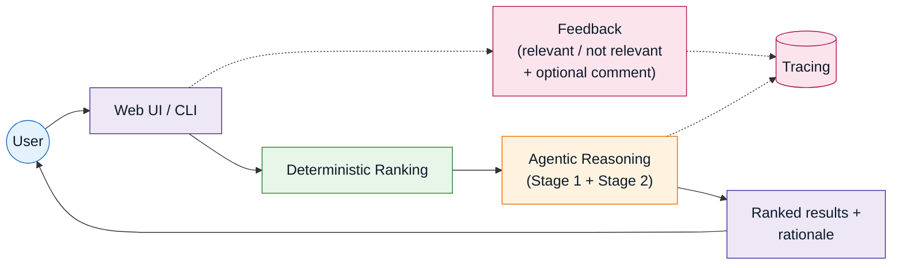
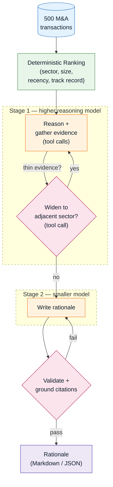
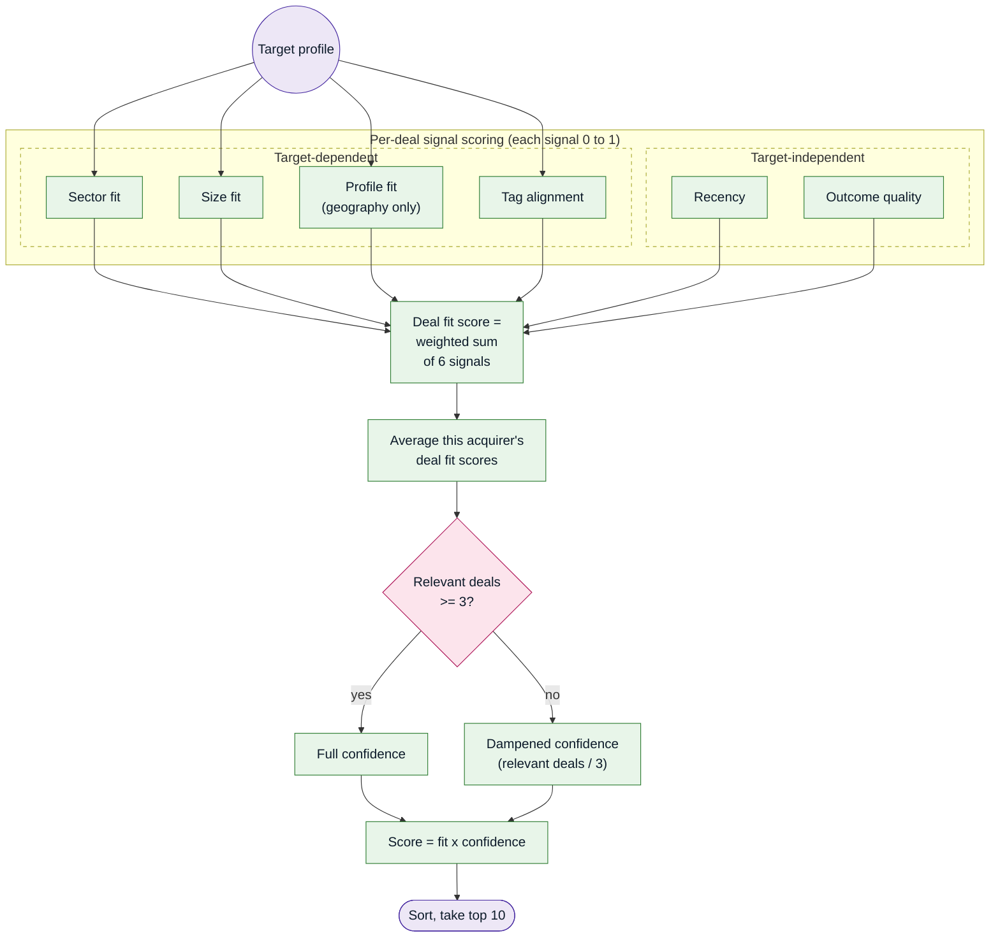
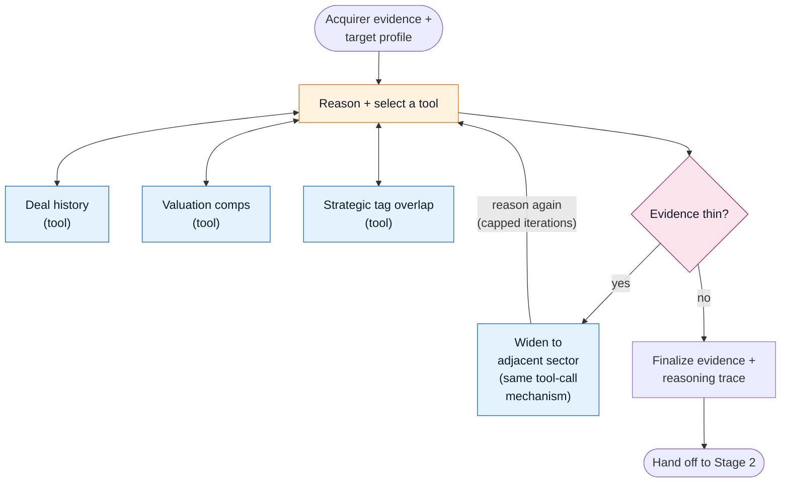

# M&A Acquirer Identification Engine

Given a target company profile (sector, deal size, geography), this engine identifies and ranks the most likely acquirers for that target, then writes a one-page, data-cited rationale for each: the kind of first-pass buyer list an M&A analyst would otherwise build by hand from deal comps and precedent transactions.

It works in two stages. First, a **deterministic ranking layer** scores every acquirer in the dataset against the target profile (sector fit, deal-size fit, recency, track record) with no LLM involved, so the shortlist itself is fully reproducible and never hardcoded (see [Architecture](#architecture) below). Then, for each of the shortlisted acquirers in parallel (`asyncio.gather`, not a sequential loop), an **agentic LLM synthesis layer** runs a reasoning step before acting, then selects and calls tools to gather the acquirer's actual deal history, dynamically decides whether to widen the search into adjacent sectors when evidence is thin, and writes the rationale into a Pydantic-validated schema with an automatic repair-retry loop, so a malformed or fabricated citation gets corrected or rejected outright, never silently shipped (see [Grounding & validation](#grounding--validation) below). The result is rationale that cites real, specific numbers, including deal counts, size ranges, and EV/EBITDA multiples pulled from the acquirer's own history, not generic boilerplate that could describe any acquirer.

The codebase mirrors that separation: ranking/scoring logic, LLM orchestration, structured-output validation, and the UI each live in their own independently-testable module, not one file doing everything. Beyond the core pipeline, this is built with production concerns in mind, not just a one-shot demo: every LLM call is traced, with per-acquirer token usage and cost visible in a dashboard rather than buried in application logs, and every generated rationale can be flagged relevant/not-relevant directly from the web UI, attached to that specific trace. A comparison mode runs two target profiles side by side in one view. See [Observability & feedback](#observability--feedback) below.

The data underneath is a 500-row historical U.S. healthcare M&A transaction dataset, one row per deal, with the acquirer, target, sector, deal size, valuation multiples, and outcome for each. See [data description](docs/data_description.md) for the full data profile (column-by-column breakdown, categorical distributions, numeric ranges, top acquirers by deal count) if you want to understand the raw material the ranking and rationale generation are built on.

## Architecture

#### Bird's-eye view 
A user (via the web UI or CLI) submits a target profile, which flows through deterministic ranking and then agentic reasoning before results come back. Every agentic call is traced automatically, and a user can flag any result as relevant or not, with that feedback landing in the same trace store. From here, the sections below walk through each major component in turn: the full pipeline end to end, then deterministic ranking on its own, then the two-stage LLM synthesis pipeline in detail, then how that pipeline's non-determinism is handled, then how outputs get grounded and validated before shipping, then how tracing and feedback attach to that same trace store, then the web UI's two tabs.


<p align="center"><small><em>Figure 1 — System overview: the user-facing loop, with tracing and feedback as side-branches into the same trace store.</em></small></p>

#### End-to-end pipeline
Here we show the detail behind Figure 1's "Deterministic Reasoning" and "Agentic Reasoning" boxes, the full pipeline end to end: deterministic ranking narrows the field first, scoring every acquirer against the target with no LLM involved, before any agentic work starts. Each shortlisted acquirer then goes through Stage 1 (gather evidence, decide whether to widen the search) and Stage 2 (write the rationale, also folding in Wikipedia-sourced facts for that acquirer, which bypass Stage 1 entirely and feed straight into Stage 2), and a validate-and-ground step checks every precedent-activity citation against the source data (see [Grounding & validation](#grounding--validation) below for exactly what's covered) before anything ships, retrying Stage 2 if a citation doesn't hold up. 


<p align="center"><small><em>Figure 2 — Pipeline: ranking hands off to a two-stage agentic loop, then a validate/ground step that can retry before a rationale ships.</em></small></p>

#### Deterministic ranking

A two-tier fit score (sector adjacency, size, profile, recency, outcome quality, tag alignment) rolled up per
acquirer with a confidence dampener so one lucky deal can't outrank a real track record. Fully reproducible;
the shortlist is derived from data every run, never hardcoded. Weights are documented constants, not fitted —
see [weight sensitivity](docs/weight_sensitivity.md) for how much perturbing each one moves the top-10 ranking.

**Sector adjacency is data-derived, not a hand-tuned prior.** Two sectors count as "adjacent" when the same
acquirers tend to buy in both — measured from actual deal history, not asserted. Generalist PE mega-funds
(active in 8-10 of 10 sectors) are downweighted so they don't make every sector look adjacent to every other
sector just by being everywhere; a specialist buyer overlapping two sectors is a much stronger signal. Verified
target-sensitive: top-10 overlap with the Healthcare Services default ranges 0-5/10 across the other 9 synthetic
profiles, and acquirer-type mix (Strategic vs. Financial Sponsor) varies realistically by sector rather than
sitting at a fixed ratio.

How the ranking layer actually scores and ranks acquirers, target-profile centric:


<p align="center"><small><em>Figure 3 — Deterministic ranking: six signals combine into one deal fit score per
deal, deals are then averaged per acquirer, and the confidence dampener scales the result before sorting.</em></small></p>

#### LLM synthesis: Stage 1 + Stage 2

**LLM synthesis is a two-stage, tool-calling pipeline** (why not one prompt per acquirer? because that has no
tool use and no LLM-driven routing, just a schema-constrained wrapper around one call):

- **Stage 1 (a higher-reasoning model)** decides which evidence to gather — the acquirer's precedent deals,
  valuation comps, and strategic-tag overlap with the target — by choosing and calling tools for each one, then,
  when that evidence turns out thin, decides for itself whether to widen the search into an adjacent sector.
  That widening decision is the one place the model's own judgment actually changes what happens next; tools
  called the same way every time regardless of the output don't count as real routing. The model also writes
  out its reasoning before finalizing anything, and its output here stays short and cheap on purpose.

What Stage 1 actually does for one acquirer:


<p align="center"><small><em>Figure 4 — Stage 1's loop for one acquirer (of 10, run concurrently): the model selects among three evidence tools, then conditionally widens the search using the same tool-call mechanism.</em></small></p>

- **Stage 2 (a smaller, cheaper model)** takes Stage 1's finished dossier and reasoning and writes the
  six-section rationale into the final structured report. It never calls a tool and never re-decides anything —
  it's purely writing up what Stage 1 already figured out. The split is driven by capability fit, not just cost:
  writing prose from an already-decided dossier doesn't need the reasoning depth that gathering evidence and
  deciding whether to widen the search does, so a smaller model handles it just as well, and the lower cost
  follows from that fit rather than being the reason for it. It can fall back to the higher-reasoning model if
  needed. Every output it writes is checked and, if needed, repaired — see [Grounding & validation](#grounding--validation) below.

#### Non-determinism handling

Every LLM call runs at zero temperature, keeping output as reproducible as the model allows. Residual
run-to-run variance in the prose itself is a model property this can't fully eliminate — everything on either
side of it is fully deterministic: the ranking layer that feeds it (see
[Deterministic ranking](#deterministic-ranking) above), and the retry/validation path that catches whatever
that variance produces (see [Grounding & validation](#grounding--validation) below).

#### Grounding & validation

Every rationale goes through two independent checks before it's accepted, both automated, neither an LLM call:

- **Structural validation**: required sections are present, there's a minimum number of risk flags, and a
  business rule the structure alone can't enforce — the model's stated Conviction level has to match the
  rank-derived level the ranking layer already computed. Conviction is owned entirely by the deterministic
  ranking layer; the model only has to justify it, never decide it.
- **Citation grounding**, not just a structural check: every precedent deal the model cites is checked against
  the acquirer's real deal history, matched by target and year, confirmed unique across the full dataset. Any
  valuation figures the model cites are also diffed against independently computed values, with a small
  tolerance. Either kind of failure triggers the same retry-with-correction path as a structural failure; a
  citation still wrong after one retry causes a hard failure for that acquirer rather than shipping something
  fabricated. Every accepted citation is also annotated with exactly which row of the source data it came from,
  shown alongside it in every output format, so a reviewer can spot-check any citation directly against the raw
  dataset without re-deriving anything.

#### Observability & feedback

Every run is fully traceable through Langfuse: one trace per run, with all ten acquirers nested underneath it,
and within each acquirer, Stage 1 and Stage 2 broken out as their own steps showing token usage and cost —
including a self-computed figure for the cheaper model, since Langfuse's automatic pricing doesn't know its
custom rate. That turns what would otherwise be scattered application logs into a single dashboard view of
exactly what every call cost and how long it took. Tracing is entirely optional, and safely absent wherever
it isn't configured, including in tests.

Every acquirer card in the web UI also carries "Relevant" / "Not relevant" buttons, and clicking one attaches
a score directly to that acquirer's trace, visible right alongside its cost and token data in the same
dashboard. This is **trace-attached feedback**: a human-reviewable annotation, not a closed loop that changes
future rankings on its own — but it turns one-off reviewer pushback into something durable and traceable back
to the exact run it came from.

#### Web UI

Two tabs, both thin wrappers around the same pipeline the CLI uses — no separate logic, just a different way
in:

- **Rank**: pick a synthetic profile or enter a custom one, get a ranked table and an expandable rationale
  card per acquirer, each with the flag button described above.
- **Compare**: pick two profiles, get two side-by-side ranked lists (same cards, same flag buttons), with an
  overlap count and each profile's completion time.

Two identical requests for the same profile racing each other land in a benign last-writer-wins race on that
profile's saved output, the same as running the pipeline twice concurrently from the command line; not
specially handled.

## Setup & usage

### Environment variables

See `.env.example` for the full list with defaults; copy it to `.env` and fill in real values (`.env` is
gitignored, never commit it). What's actually required:

| Variable | Required | Purpose |
|---|---|---|
| `ANTHROPIC_API_KEY` | Yes, unless `MOCK_LLM=1` | Stage 1: tool-calling, evidence gathering, routing. Also powers Stage 2 if `STAGE2_BACKEND=anthropic`. |
| `OPENCODE_API_KEY` | Yes, unless `STAGE2_BACKEND=anthropic` | Stage 2: bulk rationale synthesis (the default, cheaper backend). |

Everything else is optional and has a working default:

| Variable | Default | Purpose |
|---|---|---|
| `MOCK_LLM` | unset | Set to `1` to run the full pipeline with deterministic canned rationales and zero API calls — no keys needed at all. |
| `ANTHROPIC_MODEL` | `claude-haiku-4-5-20251001` | The Stage 1 model. |
| `STAGE2_BACKEND` | `opencode-go` | Switch to `anthropic` to run Stage 2 on the same model as Stage 1 instead, e.g. if opencode-go is unreachable. |
| `STAGE2_MODEL` | `gpt-5.6-luna` | The Stage 2 model, when `STAGE2_BACKEND=opencode-go`. |
| `LANGFUSE_PUBLIC_KEY` / `LANGFUSE_SECRET_KEY` / `LANGFUSE_BASE_URL` | unset | Turn on tracing (see [Observability & feedback](#observability--feedback) above). Tracing only activates once `LANGFUSE_PUBLIC_KEY` is set; everything, including `MOCK_LLM=1` and the test suite, runs identically without it. |

### Execution commands

`run.sh` creates/reuses a `.venv`, installs dependencies, and loads `.env` automatically — no other setup,
either path below. It's a deliberate alternative to a container: same one-command, no-manual-setup outcome,
without adding a Docker dependency this prototype doesn't otherwise need.

- **CLI**:

  ```bash
  # No API key needed: deterministic canned rationales, fully offline
  MOCK_LLM=1 ./run.sh rank --profile healthcare_services_200mm

  # Real synthesis (requires ANTHROPIC_API_KEY + OPENCODE_API_KEY, see Environment variables above)
  ./run.sh rank --profile healthcare_services_200mm

  # Run all 10 synthetic test profiles (see data/synthetic_profiles.json)
  ./run.sh rank --all-profiles

  # Custom target profile
  ./run.sh rank --sector "Medical Devices" --deal-size-mm 300 --geography Midwest

  # Compare two target profiles side by side
  ./run.sh rank --compare healthcare_services_200mm health_it_150mm_national

  # Re-run the one-time Wikipedia enrichment pre-fetch for all acquirers (cache is already committed)
  ./run.sh enrich
  ```

  Every rank run writes into `output/<profile_slug>/`:

  - `summary.md` — the ranked table
  - `01_<acquirer>.md` … `10_<acquirer>.md` — one rationale per acquirer
  - `results.json` — the same data, machine-readable
  - A live run takes 30-45 seconds end to end, all 10 rationales generated concurrently, well under the 60-second target.

  Two commands behave a bit differently: 
  - `enrich` re-runs the one-time Wikipedia pre-fetch for all acquirers, and isn't required to run the ranker since the cache is already committed.
  - `--compare SLUG_A SLUG_B` runs both target profiles' full pipelines concurrently and writes a side-by-side overlap summary alongside each profile's own output, and only accepts known profile slugs, not arbitrary custom ones.

- **Web UI**:

  ```bash
  MOCK_LLM=1 ./run.sh serve --port 8000   # or drop MOCK_LLM=1 for real synthesis
  ```

  Open `http://localhost:8000/`. See the [Web UI](#web-ui) section under Architecture above for what the two
  tabs provide.

## Testing

```bash
MOCK_LLM=1 python -m pytest tests/ -q
```

65 tests, no live API calls needed (`MOCK_LLM=1` and no Langfuse keys, which is also CI's exact condition;
see `.github/workflows/tests.yml`), covering:

- The ranking/feature layer, tool schemas and dispatch, and adjacent-sector-candidate computation
  (`test_features.py`, `test_ranking.py`, `test_tools.py`).
- The full pipeline under `MOCK_LLM=1` (`test_main.py`, `test_output.py`), including a test that proves the
  widen-to-adjacent-sector output path fires correctly for a manufactured thin-evidence acquirer
  (`test_output.py`) — mock-mode plumbing, not the live routing decision itself, since CI never makes a real
  API call and so never exercises Stage 1's actual tool-calling choice.
- Grounding checks, both the "accept a real citation" and "reject a fabricated one" paths, independently at the
  `validate_rationale`/`app.grounding` level and end-to-end against real generated output (`test_output.py`,
  `test_grounding.py`), plus a near-duplicate-text check that flags suspiciously similar prose across acquirers
  within one run, catching templated/generic output as a distinct failure mode from a fabricated citation.
- The web UI's `/rank`, `/compare`, and `/feedback` routes, and that tracing being disabled never breaks
  anything (`test_server.py`, `test_tracing.py`).

Server-route tests redirect all filesystem writes to `tmp_path`: the app itself never runs `pytest` against
its own default `output/` directory, so the test suite can't clobber real generated output.

**A green run is the expected bar for merging a PR**, not an optional signal — the workflow runs on every pull
request against `main`, and passing is treated as a precondition for merge.

## Assumptions

- The default target profile (no `--sector`/`--deal-size-mm` given) is Healthcare Services, ~\$200M EV, per
  the assessment brief. Its "mid-market, private, regional, strong EBITDA margins" description only partially
  drives scoring: deal size and geography are real signals (`size_fit`, `geography_score`), but "private" and
  "strong margins" aren't compared against anything the target specifies — `ownership_score()` and
  `margin_score()` score each candidate deal against fixed, dataset-wide rules, not against a target
  preference. The same four-word description is also hardcoded into every LLM prompt (`app/prompts.py`), so a
  custom, non-default target (e.g. a \$2B target) is still described to the model as "mid-market... strong
  EBITDA margins" regardless of whether that's true for it.
- "Regional" with no specific region given is treated as "any specific region is a full geography match":
  only National/Multi-Regional deals score lower, since the target didn't rule out any particular region.
- `thesis_tags` (feeds `tag_alignment`, the smallest weight at 0.05) defaults to a fixed
  `["Platform Build", "Geographic Expansion", "Scale"]` and can't be overridden today, from the CLI or the web
  UI, so every target in every sector is scored against the same three tags.
- Tier-1 signal weights (`sector_fit` 0.30 / `size_fit` 0.25 / `profile_fit` 0.20 / `recency` 0.10 /
  `outcome_quality` 0.10 / `tag_alignment` 0.05) and the eligibility threshold (3 relevant deals for full
  confidence) are documented constants, chosen to be directionally sensible and checked against both the [target-sensitivity results](docs/target_sensitivity.md) and the [weight-sensitivity sweep](docs/weight_sensitivity.md), not fitted to any objective.
- "Relevant" deal = `sector_fit >= 0.35`; "adjacent" (widen-eligible) = `0.15 <= sector_fit < 0.35`.
- Conviction is rank-derived: High = rank ≤3, Medium = 4-7, Low = ≥8, a deliberate choice so conviction
  varies across the 10 acquirers rather than clustering, per the assessment's "conviction levels should vary
  and be defensible" guidance.
- `days_to_close` is null in ~19% of rows (only populated for `Closed` deals, which is structural, not a data
  quality bug) and isn't used by any ranking signal, so this doesn't affect scores.

## Limitations

Real gaps in what's built today, not roadmap items — things that are weaker than they should be. A few of
these are elaborated further in [`docs/extensions.md`](docs/extensions.md).

- **Grounding covers structured citations, not free-text prose.** `precedent_activity` and `valuation_context`
  are checked automatically on every run (see [Grounding & validation](#grounding--validation) above). Numbers
  embedded in prose fields (`acquirer_overview`, `risk_flags[].evidence`) aren't automatically verified. A
  manual spot-check (Atrium Health) confirmed those traced correctly too, with one 0.1x rounding slip on an
  aggregate range (9.3x cited vs. 9.2x actual), but that check isn't automated. A fuller citation validator
  extending into free text is a Stretch item, detailed further in [extensions documentation](docs/extensions.md).
- **Sector adjacency is a proxy** (buyer co-occurrence), not a direct measure of strategic adjacency — and it's
  what the widen-to-adjacent-sector decision, this system's one real routing choice, actually runs on. The IDF
  downweight sharpens it but doesn't eliminate the approximation.
- **Wikipedia enrichment covers 70/107 acquirers**, skewed toward large PE sponsors and public strategics.
  Missing acquirers fall back to CSV-only content, no crash. A business-entity filter plus one hard-coded
  exclusion catch known name-collisions but don't eliminate the risk entirely.
- **`STAGE2_BACKEND=anthropic` (opencode-go fallback) is implemented but not live-tested.** Same call shape
  Stage 1 already uses, but hasn't itself been run against a real opencode-go outage.
- **No closed-loop feedback.** The "Relevant"/"Not relevant" flags are trace-attached annotations (see
  [Observability & feedback](#observability--feedback) above), not a system that changes future rankings. That
  fuller version, plus search-augmented enrichment beyond Wikipedia, are documented as future directions in
  [`docs/extensions.md`](docs/extensions.md), not built.
- **The widen-to-adjacent-sector decision isn't surfaced structurally, only in prose.** No `widened` field in
  the output, no UI badge, nothing in the trace metadata — a reader has to infer it from the rationale text.
  Scores for these acquirers are already dampened via the same evidence count that triggers widening, so this
  is a transparency gap, not a hidden one. More in [extensions documentation](docs/extensions.md).
- **No cost-per-run figure surfaced in the app or the UI.** Token usage and cost are visible per call in the
  Langfuse dashboard when tracing is enabled; the app itself doesn't retain or display an aggregate number.

## Extensions

What this prototype would grow into with more time, framed as deliberate scope decisions rather than
shortcomings. [Extensions documentation](docs/extensions.md) goes deeper across four themes — data/target
modeling, cost/performance, quality/trust, product/platform — with more on how each would attach to the
existing architecture. One representative item per theme below, plus a second on the richest one:

- **Richer target attributes** (data/target modeling). The margin/ownership gap flagged in Assumptions above
  isn't unfixable, just unbuilt: one new signal function per attribute — e.g. comparing a deal's margin against
  what the *target* actually specified, instead of the dataset's min/max — one new `WEIGHTS` entry, renormalize.
  Additive, not a rewrite.
- **Result caching** (cost/performance). Every run re-executes the full pipeline, live LLM calls included,
  even for an identical request. A cache keyed on the full target profile would cut cost significantly for
  repeat/demo traffic; the mechanism is simple, invalidation and where it lives are the real design questions.
- **`WEIGHTS` (`app/features.py`) are hardcoded, not externalized to a config file, and are documented
  assumptions rather than fitted values** (also cost/performance). The
  [weight-sensitivity sweep](docs/weight_sensitivity.md) shows how robust the ranking is to each weight, not
  that 0.30/0.25/0.20/... is objectively optimal, and changing them today requires a code edit, not a config
  change.
- **Guardrails were considered and deliberately scoped narrow** (quality/trust). This app's real risk profile
  doesn't include untrusted free-text input — target fields are structured, not open text — so general
  prompt-injection defenses mostly aren't solving a threat that exists here. The higher-value equivalent is
  the numeric-grounding validator already built (see [Grounding & validation](#grounding--validation) above),
  a custom in-house addition rather than a new framework dependency.
- **No MCP exposure** (product/platform). This app owns both the tools and the only client, so MCP would add
  protocol overhead with no functional benefit today; scoped out deliberately, not a gap.
- **No production deployment path** (also product/platform): no container image, no secrets manager, no rate
  limiting or health checks. `run.sh` already gives one-command, no-manual-setup execution at this scale, so a
  container would add a dependency rather than remove one — this starts to earn its keep once there's a real
  multi-user deploy target to orchestrate.

- **Deal-team AI copilots (Rogo, BlueFlame)** calling this engine as a tool through the MCP exposure above, and this engine in turn calling a meeting-history tool (e.g. Fellow) as a new evidence source growth that would also be the trigger to migrate Stage 1's hand-rolled tool loop to a proper agentic harness like LangGraph. Detailed in [extensions documentation](docs/extensions.md).
