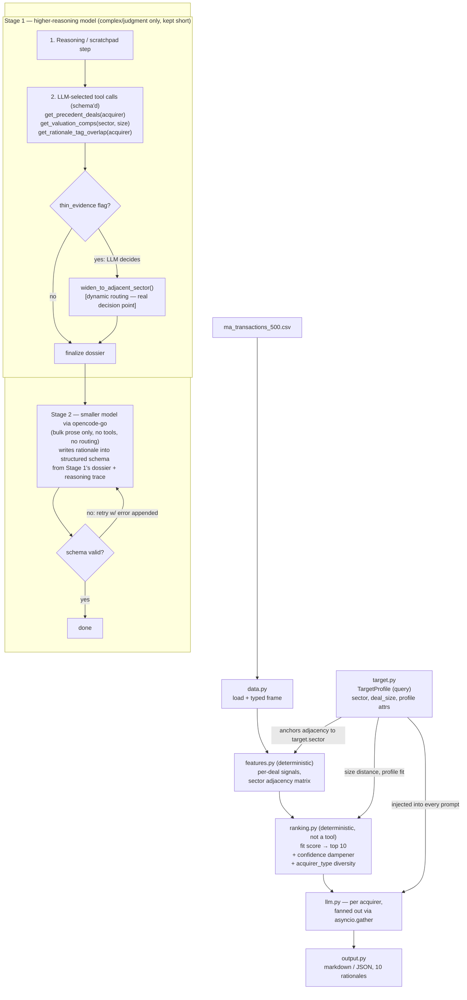

# Architecture

## Pipeline

Two-stage split is capability-fit driven, with lower cost following naturally from that fit rather than being
the reason for it: Stage 1's job (deciding what evidence to pull, whether to widen the sector search, reasoning
through it) genuinely needs a higher-reasoning model. Stage 2's job (six prose sections × 10 acquirers, written
from a dossier Stage 1 already finalized) doesn't — using a high-reasoning model there would be reaching for a
sledgehammer where a hammer does the job, so it runs on a smaller model instead. That smaller model never calls
a tool and never makes the routing decision; it only ever sees a fully-decided dossier plus Stage 1's reasoning
trace and writes prose into the schema. The validate/repair loop wraps Stage 2's output specifically.

## Design decisions

- **Deterministic backbone (`data → features → ranking`) has no LLM in the loop.** Fully reproducible, satisfies
  the "no hardcoded acquirer list" rule — the ranking is derived from data, not asserted.
- **The core fit-score computation is plain Python, not a tool the LLM calls.** There's no real decision for the
  LLM to make there, so wrapping it as a "tool" would be decorative rather than agentic — see the tool-use
  discussion below.
- **The agentic part lives entirely in `llm.py`**: a reasoning/scratchpad step, LLM-selected tool calls with
  defined schemas, one genuine dynamic-routing decision (widen to adjacent sector when evidence is thin), then
  validated structured output with a repair loop on failure.
- **Tool use without MCP.** Tools are plain Python functions exposed via the Anthropic Messages API's native
  `tools` schema param — no MCP server needed, since this app owns both the tool implementations and the only
  LLM client calling them.
- **10 acquirers processed concurrently** via `asyncio.gather` — wall-clock is ~one rationale's latency, not 10x.

## What makes a tool call "real" vs. decorative

Test: does the LLM's choice change what code path executes? `get_precedent_deals(acquirer)` etc. are called in a
fixed sequence for every acquirer regardless of LLM output — necessary evidence, but not a decision. The
`widen_to_adjacent_sector()` call is conditional on the LLM's read of a thin-evidence flag — that's the one
genuine "LLM output determines next step" moment in the pipeline, which is the distinguishing mark of real
agentic behavior vs. a schema-constrained prompt wrapper.

## Target profile enters once, threads through three stages differently

The target profile (sector, deal_size_mm, geography) is a plain dict passed in once at the top and threaded
through by reference:
- `features.py` anchors the sector-adjacency cosine-similarity computation to `target.sector`.
- `ranking.py` uses `target.deal_size_mm` and profile attributes for size-distance and profile-fit signals.
- `llm.py` injects the target profile into every acquirer's prompt so the rationale explains fit to *this*
  target specifically, not just the acquirer's general history.

Because the profile is already a plain input rather than something baked into the ranking logic, the stretch
goal — arbitrary target profiles — is already largely satisfied: `main.py` accepts `--sector`/`--deal-size-mm`/
`--geography` directly, in addition to named profiles from `data/synthetic_profiles.json`.

## Multi-target-profile testing

Sector adjacency is unvalidated until it's shown to actually move with the target. `data/synthetic_profiles.json`
has ~10 target profiles across different sectors for exactly this check; results go in
`docs/target_sensitivity.md` once run — top-10 overlap with the Healthcare Services default should vary by
target, confirming the ranking isn't defaulting to the
same PE mega-funds regardless of input.
